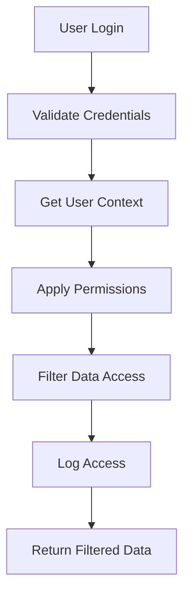

# 🔄 Scalix Data Consistency & User Context System

## Overview

This guide explains how the Scalix platform maintains data consistency and shows relevant data to the intended user across all applications: **Web App**, **Internal Admin Portal**, and **Electron Desktop App**.

---

## 🏗️ System Architecture

### Core Components

```
┌─────────────────┐    ┌──────────────────┐    ┌─────────────────┐
│   Web App       │    │  Cloud API       │    │ Internal Admin  │
│   (Port 3000)   │◄──►│  (Port 8080)     │◄──►│   (Port 3002)   │
│                 │    │                  │    │                 │
│ • Public SaaS   │    │ • Data Context   │    │ • Team Portal   │
│ • User Dashboard│    │ • Sync Manager   │    │ • Admin Tools   │
│ • Billing       │    │ • Real-time      │    │ • Analytics     │
└─────────────────┘    └──────────────────┘    └─────────────────┘
        ▲                       ▲                       ▲
        │                       │                       │
┌─────────────────┐    ┌──────────────────┐    ┌─────────────────┐
│ Electron App    │    │   Firestore      │    │   Stripe        │
│   (Desktop)     │    │   Database       │    │   Payments      │
│                 │    │                  │    │                 │
│ • Desktop UI    │    │ • User Data      │    │ • Subscriptions │
│ • Local Sync    │    │ • Usage Stats    │    │ • Webhooks      │
│ • API Keys      │    │ • Audit Logs     │    │                 │
└─────────────────┘    └──────────────────┘    └─────────────────┘
```

### Data Flow

1. **User Context Detection**: Each application detects user context
2. **Permission Filtering**: Data is filtered based on user roles
3. **Real-time Sync**: Changes are synchronized across applications
4. **Audit Logging**: All data access is logged for security

---

## 👤 User Context System

### User Roles & Permissions

```typescript
type UserRole = 'user' | 'admin' | 'super_admin'

interface UserPermissions {
  // Admin permissions
  view_admin_dashboard: boolean
  manage_users: boolean
  manage_plans: boolean
  view_analytics: boolean

  // Data permissions
  view_internal_data: boolean
  manage_internal_data: boolean

  // Application-specific
  web_app_access: boolean
  internal_admin_access: boolean
  electron_app_access: boolean
}
```

### Application Context Detection

```javascript
// Automatic detection based on request origin
const application = detectApplication(request);

// Web App: localhost:3000 or scalix.world
// Internal Admin: localhost:3002 or x-internal-admin header
// Electron: user-agent contains "Electron"
```

### Data Filtering by Role

| Role | Can View | Can Edit | Data Scope |
|------|----------|----------|------------|
| **user** | Own data | Own data | Limited |
| **admin** | Team data | Team data | Extended |
| **super_admin** | All data | All data | Full |

---

## 🔄 Data Synchronization

### Real-Time Sync Features

- **Live Updates**: Changes sync across all applications
- **Conflict Resolution**: Automatic conflict detection and resolution
- **Offline Support**: Local caching for offline operations
- **Background Sync**: Periodic synchronization of critical data

### Sync Collections

```javascript
const syncCollections = [
  'users',        // User management
  'plans',        // Subscription plans
  'usage',        // Usage statistics
  'notifications', // System notifications
  'audit_logs'    // Security audit logs
];
```

### Manual Sync API

```javascript
// Trigger sync between applications
const result = await client.triggerSync('web', 'internal-admin', [
  'users', 'plans', 'usage'
]);

console.log('Sync completed:', result);
```

---

## 📊 Data Visibility by Application

### Web Application (Public SaaS)

**Shows to Users:**
- Personal dashboard and usage
- Billing information and invoices
- API key management
- Account settings and preferences

**Hidden from Users:**
- Other users' data
- Internal system metrics
- Admin-only features
- Server configuration

### Internal Admin Portal

**Shows to Admins:**
- All user accounts and data
- System health and metrics
- Plan management and analytics
- Security audit logs
- Billing and revenue data

**Filtered by Admin Level:**
- Regular admins see team data
- Super admins see everything

### Electron Desktop App

**Shows to Users:**
- Local dashboard with sync status
- Personal usage statistics
- API key validation
- Application settings

**Syncs with Cloud:**
- User preferences
- Usage data
- Application state
- Offline queue

---

## 🚀 Implementation Guide

### 1. Initialize Client SDK

```javascript
// For Web Application
import { createWebClient } from '@scalix/client-sdk';

const client = createWebClient({
  baseUrl: 'https://api.scalix.world',
  apiKey: userApiKey,
  syncEnabled: true,
  realTimeEnabled: true
});

// For Internal Admin
import { createInternalAdminClient } from '@scalix/client-sdk';

const adminClient = createInternalAdminClient({
  baseUrl: 'https://api.scalix.world',
  syncEnabled: true
});
```

### 2. Get User Context

```javascript
// Get current user context and permissions
const userContext = await client.getUserContext();

console.log('User Role:', userContext.role);
console.log('Permissions:', userContext.permissions);
console.log('Feature Flags:', userContext.featureFlags);
```

### 3. Fetch Filtered Data

```javascript
// Get data filtered for current user
const plans = await client.getData('plans');
const users = await client.getData('users', { limit: 50 });
const analytics = await client.getData('analytics', {
  dateRange: 'last_30_days'
});
```

### 4. Real-Time Updates

```javascript
// Subscribe to data changes
const unsubscribe = client.onDataChange('plans', (event, data) => {
  console.log('Plans updated:', event, data);
  // Update UI with new data
});

// Later: unsubscribe to stop listening
unsubscribe();
```

### 5. Manual Synchronization

```javascript
// Sync data between applications
const syncResult = await client.triggerSync(
  'web',           // Source app
  'internal-admin', // Target app
  ['users', 'plans'] // Collections to sync
);

if (syncResult.success) {
  console.log('✅ Sync completed successfully');
  console.log('Synced items:', syncResult.changes);
}
```

---

## 🔐 Security & Access Control

### Authentication Flow



### Permission Checks

```javascript
// Check if user can perform action
const canEditUsers = await client.canPerformAction('manage_users', 'users');

if (canEditUsers) {
  // Show edit controls
  showUserEditForm();
} else {
  // Show read-only view
  showUserDetails();
}
```

### Data Sanitization

```javascript
// Data is automatically filtered based on user context
const userData = await client.getData('users', { id: userId });

// Result includes only fields the user can access
console.log(userData); // { id, name, email, plan } - no sensitive data
```

---

## 📈 Monitoring & Analytics

### Sync Status Monitoring

```javascript
// Get current sync status
const syncStatus = await client.getSyncStatus();

console.log('Cache entries:', syncStatus.cache.totalEntries);
console.log('Cache size:', syncStatus.cache.totalSize);
console.log('Active collections:', syncStatus.collections.length);
```

### Audit Logging

```javascript
// All data access is automatically logged
const auditLogs = await client.getData('audit_logs', {
  userId: currentUser.id,
  dateRange: 'last_7_days'
});

// Logs include:
// - Who accessed what data
// - When the access occurred
// - What application was used
// - IP address and user agent
```

### Performance Monitoring

```javascript
// Monitor API performance
const metrics = await client.getData('performance_metrics');

console.log('Average response time:', metrics.avgResponseTime);
console.log('Cache hit rate:', metrics.cacheHitRate);
console.log('Sync latency:', metrics.syncLatency);
```

---

## 🛠️ Configuration Options

### Client Configuration

```javascript
const client = new ScalixClient({
  // Connection settings
  baseUrl: 'https://api.scalix.world',
  apiKey: 'your-api-key',

  // Sync settings
  syncEnabled: true,
  realTimeEnabled: true,
  cacheEnabled: true,

  // Application context
  application: 'web',
  version: '2.1.0',

  // Performance settings
  cacheMaxAge: 300000,        // 5 minutes
  syncInterval: 30000,        // 30 seconds
  retryAttempts: 3
});
```

### Environment Variables

```bash
# Application Configuration
SCALIX_API_URL=https://api.scalix.world
SCALIX_APP_NAME=scalix-web
SCALIX_APP_VERSION=2.1.0

# Sync Configuration
ENABLE_REAL_TIME_SYNC=true
SYNC_INTERVAL=30000
CACHE_MAX_AGE=300000

# Security
API_KEY_ENCRYPTION_KEY=your-encryption-key
JWT_SECRET=your-jwt-secret
```

---

## 🔧 Troubleshooting

### Common Issues

**1. Data Not Syncing**
```javascript
// Check sync status
const status = await client.getSyncStatus();
console.log('Sync status:', status);

// Force manual sync
await client.triggerSync('web', 'internal-admin', ['users']);
```

**2. Permission Denied**
```javascript
// Check user permissions
const context = await client.getUserContext();
console.log('User permissions:', context.permissions);

// Verify role
console.log('User role:', context.role);
```

**3. Cache Issues**
```javascript
// Clear cache
client.clearCache(); // Clear all
client.clearCache('users'); // Clear specific collection

// Check cache stats
const stats = client.getCacheStats();
console.log('Cache stats:', stats);
```

**4. Connection Issues**
```javascript
// Test connection
const isConnected = await client.testConnection();
if (!isConnected) {
  console.error('Cannot connect to Scalix API');
  // Implement fallback or retry logic
}
```

---

## 📚 Best Practices

### For Developers

1. **Always Use the Client SDK**: Don't make direct API calls
2. **Check Permissions**: Always verify user permissions before showing features
3. **Handle Offline States**: Implement offline support for critical features
4. **Monitor Performance**: Track API response times and cache hit rates
5. **Log Important Actions**: Use audit logging for security-critical operations

### For Administrators

1. **Monitor Sync Status**: Regularly check synchronization health
2. **Review Audit Logs**: Monitor data access patterns
3. **Manage User Roles**: Keep user roles and permissions up to date
4. **Plan for Scaling**: Monitor usage patterns and plan for growth

### For Users

1. **Understand Data Visibility**: Know what data is shared across applications
2. **Use Consistent Login**: Use the same account across all Scalix applications
3. **Monitor Activity**: Review your data access and usage patterns

---

## 🎯 Next Steps

1. **Implement Client SDK** in all applications
2. **Set up Real-time Sync** for critical data
3. **Configure Audit Logging** for security monitoring
4. **Test Cross-Application Data Flow** thoroughly
5. **Monitor Performance** and optimize as needed

This system ensures that users see relevant, secure data while maintaining consistency across all Scalix applications. The role-based access control and real-time synchronization provide a seamless experience while maintaining enterprise-grade security.

**Ready to implement data consistency across your Scalix applications! 🚀**
