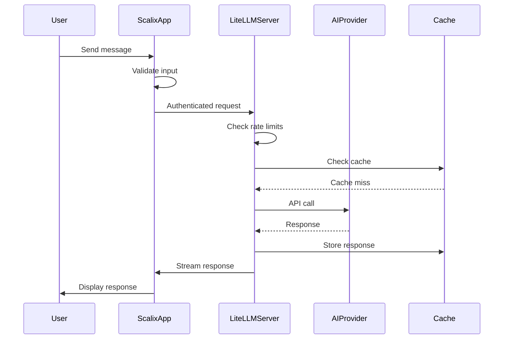
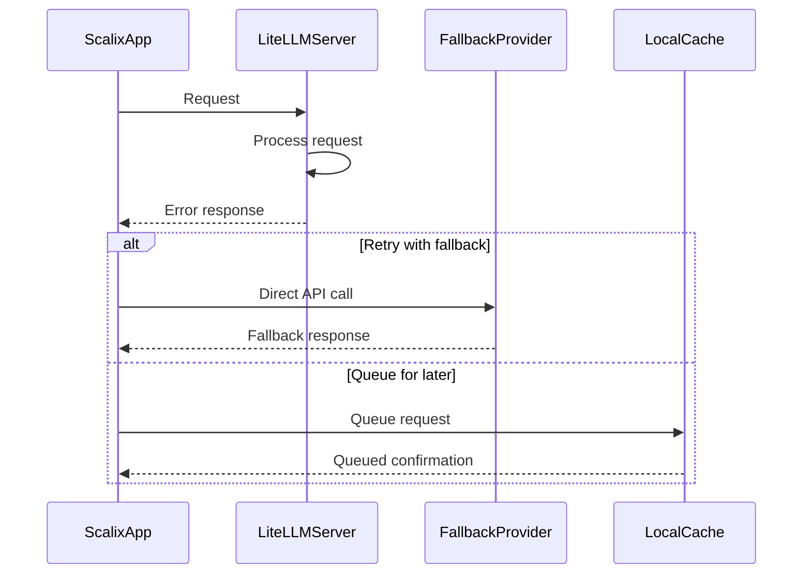

# 🔄 Scalix ↔ LiteLLM Communication Architecture

## Executive Summary

This document outlines the communication architecture between **Scalix** (running on user's personal PC) and **LiteLLM** (running on our internal server). The integration requires careful consideration of network protocols, security, performance, and user experience to ensure seamless operation across different network conditions and user scenarios.

**Key Challenges Addressed:**
- ✅ Secure communication between local app and remote server
- ✅ Offline functionality and graceful degradation
- ✅ Performance optimization for real-time AI interactions
- ✅ User privacy and data protection
- ✅ Scalability for concurrent users
- ✅ Error handling and fallback mechanisms

---

## 📋 Table of Contents

1. [Communication Architecture Overview](#communication-architecture-overview)
2. [Network Protocol Options](#network-protocol-options)
3. [Security & Authentication](#security--authentication)
4. [Data Flow Patterns](#data-flow-patterns)
5. [Performance Optimization](#performance-optimization)
6. [Offline & Error Handling](#offline--error-handling)
7. [Implementation Details](#implementation-details)
8. [Monitoring & Debugging](#monitoring--debugging)
9. [User Experience Considerations](#user-experience-considerations)
10. [Migration Strategy](#migration-strategy)

---

## 🏗️ Communication Architecture Overview

### Current Architecture (Before Integration)

```
┌─────────────────┐    ┌─────────────────┐    ┌─────────────────┐
│   Scalix App    │────│  Direct API     │────│  AI Providers   │
│  (User's PC)    │    │    Calls        │    │                 │
│                 │    │                 │    │ - OpenAI        │
└─────────────────┘    └─────────────────┘    │ - Anthropic     │
                                              │ - Google        │
                                              └─────────────────┘
```

### Proposed Architecture (After Integration)

```
┌─────────────────┐    ┌─────────────────┐    ┌─────────────────┐
│   Scalix App    │────│   LiteLLM       │────│  AI Providers   │
│  (User's PC)    │    │   Server        │    │                 │
│                 │    │  (Our Server)   │    │ - OpenAI        │
└─────────────────┘    └─────────────────┘    │ - Anthropic     │
         │                                    │ - Google        │
         │                                    └─────────────────┘
         ▼
┌─────────────────┐    ┌─────────────────┐
│   Local Cache   │    │  Offline Mode   │
│   & Queue       │    │  Fallback       │
└─────────────────┘    └─────────────────┘
```

### Key Communication Components

#### 1. **Primary Communication Channel**
- **Protocol**: HTTPS/WebSocket
- **Purpose**: Real-time AI completions and streaming
- **Security**: TLS 1.3 with certificate pinning

#### 2. **Fallback Mechanisms**
- **Local Caching**: Queue requests when offline
- **Direct API Fallback**: Emergency direct provider access
- **Offline Mode**: Limited functionality without server

#### 3. **Authentication Layer**
- **User Identification**: Anonymous/Free vs Pro users
- **API Key Management**: Secure key transmission and storage
- **Session Management**: Persistent connections with reconnection

---

## 🌐 Network Protocol Options

### Primary Protocol: HTTPS + WebSocket

#### **RESTful API (HTTPS)**
```typescript
// Primary communication for standard requests
const API_ENDPOINTS = {
  completion: 'https://api.scalix.world/v1/completion',
  streaming: 'wss://api.scalix.world/v1/stream',
  health: 'https://api.scalix.world/v1/health',
  user: 'https://api.scalix.world/v1/user'
};
```

#### **WebSocket Streaming**
```typescript
// Real-time streaming for AI responses
class ScalixWebSocketClient {
  private ws: WebSocket;
  private reconnectAttempts = 0;
  private maxReconnectAttempts = 5;

  connect(userId: string, sessionId: string) {
    this.ws = new WebSocket(`${API_ENDPOINTS.streaming}?user=${userId}&session=${sessionId}`);

    this.ws.onopen = () => {
      console.log('Connected to LiteLLM server');
      this.reconnectAttempts = 0;
    };

    this.ws.onmessage = (event) => {
      const data = JSON.parse(event.data);
      this.handleMessage(data);
    };

    this.ws.onclose = () => {
      this.handleReconnection();
    };

    this.ws.onerror = (error) => {
      console.error('WebSocket error:', error);
      this.handleReconnection();
    };
  }

  private handleReconnection() {
    if (this.reconnectAttempts < this.maxReconnectAttempts) {
      setTimeout(() => {
        this.reconnectAttempts++;
        console.log(`Reconnecting... Attempt ${this.reconnectAttempts}`);
        this.connect(this.userId, this.sessionId);
      }, Math.pow(2, this.reconnectAttempts) * 1000); // Exponential backoff
    } else {
      console.log('Max reconnection attempts reached, switching to offline mode');
      this.enterOfflineMode();
    }
  }
}
```

### Alternative Protocols Considered

#### **GraphQL (Alternative)**
```typescript
// GraphQL could provide more flexible queries
const COMPLETION_QUERY = `
  query GetCompletion($messages: [Message!]!, $model: String!) {
    completion(messages: $messages, model: $model) {
      id
      choices {
        message {
          content
          role
        }
        finish_reason
      }
      usage {
        prompt_tokens
        completion_tokens
        total_tokens
      }
    }
  }
`;
```

#### **gRPC (High-Performance Alternative)**
```protobuf
// gRPC for high-performance scenarios
service ScalixAI {
  rpc Completion(CompletionRequest) returns (CompletionResponse);
  rpc StreamCompletion(CompletionRequest) returns (stream CompletionChunk);
}

message CompletionRequest {
  repeated Message messages = 1;
  string model = 2;
  string user_id = 3;
  string session_id = 4;
}
```

### Protocol Selection Criteria

| Protocol | Performance | Complexity | Browser Support | Streaming | Offline Support |
|----------|-------------|------------|-----------------|-----------|-----------------|
| **HTTPS + WS** | ⭐⭐⭐⭐⭐ | ⭐⭐⭐ | ✅ Full | ✅ Excellent | ⚠️ Limited |
| **GraphQL** | ⭐⭐⭐⭐ | ⭐⭐⭐⭐ | ✅ Good | ✅ Good | ❌ None |
| **gRPC** | ⭐⭐⭐⭐⭐ | ⭐⭐⭐⭐⭐ | ⚠️ Limited | ✅ Excellent | ❌ None |

**Recommendation**: **HTTPS + WebSocket** - Best balance of performance, compatibility, and features

---

## 🔒 Security & Authentication

### Authentication Flow

#### **1. Initial Connection**
```typescript
// Client-side authentication
const authHeaders = {
  'Authorization': `Bearer ${userToken}`,
  'X-Scalix-Client': 'desktop-app',
  'X-Scalix-Version': app.getVersion(),
  'X-Scalix-Session': generateSessionId()
};
```

#### **2. Token Management**
```typescript
class AuthManager {
  private tokens = new Map<string, TokenInfo>();

  async getValidToken(userId: string): Promise<string> {
    const tokenInfo = this.tokens.get(userId);

    if (!tokenInfo || this.isTokenExpired(tokenInfo)) {
      const newToken = await this.refreshToken(userId);
      this.tokens.set(userId, {
        token: newToken,
        expiresAt: Date.now() + TOKEN_LIFETIME
      });
    }

    return this.tokens.get(userId)!.token;
  }

  private isTokenExpired(tokenInfo: TokenInfo): boolean {
    return Date.now() > (tokenInfo.expiresAt - EXPIRY_BUFFER);
  }
}
```

### Security Measures

#### **Transport Security**
- ✅ **TLS 1.3** with perfect forward secrecy
- ✅ **Certificate pinning** to prevent MITM attacks
- ✅ **HSTS** headers for HTTPS enforcement

#### **Data Protection**
- ✅ **End-to-end encryption** for sensitive data
- ✅ **Request signing** to prevent tampering
- ✅ **Rate limiting** per user and IP
- ✅ **Input validation** and sanitization

#### **API Key Security**
```typescript
// Secure API key transmission
const secureKeyTransmission = {
  // Never send API keys in query parameters
  bad: 'https://api.scalix.world/v1/completion?api_key=sk-123',

  // Always use Authorization header
  good: {
    url: 'https://api.scalix.world/v1/completion',
    headers: {
      'Authorization': 'Bearer encrypted_api_key',
      'X-Request-Signature': signRequest(requestBody, privateKey)
    }
  }
};
```

### User Privacy Protection

#### **Data Minimization**
- ✅ **Anonymous IDs** for free users
- ✅ **Minimal data collection** - only what's necessary
- ✅ **Local processing** when possible
- ✅ **User consent** for data collection

#### **GDPR Compliance**
- ✅ **Data retention policies** with automatic cleanup
- ✅ **User data export/deletion** capabilities
- ✅ **Audit logging** for compliance
- ✅ **Privacy by design** principles

---

## 📊 Data Flow Patterns

### Standard Completion Flow

```
1. User Input
      ↓
2. Scalix Client Validation
      ↓
3. Authentication Check
      ↓
4. Rate Limit Check
      ↓
5. Request to LiteLLM Server
      ↓
6. LiteLLM Provider Selection
      ↓
7. AI Provider API Call
      ↓
8. Response Processing
      ↓
9. Streaming Back to Client
      ↓
10. Client Response Display
```

### Detailed Data Flow



### Error Handling Flow



---

## ⚡ Performance Optimization

### Connection Optimization

#### **Connection Pooling**
```typescript
class ConnectionPool {
  private pool = new Map<string, WebSocket>();
  private maxConnections = 10;

  getConnection(userId: string): WebSocket {
    if (this.pool.has(userId)) {
      return this.pool.get(userId)!;
    }

    if (this.pool.size >= this.maxConnections) {
      // Reuse oldest connection
      const oldestUser = this.pool.keys().next().value;
      this.pool.delete(oldestUser);
    }

    const connection = this.createConnection(userId);
    this.pool.set(userId, connection);
    return connection;
  }
}
```

#### **Persistent Connections**
```typescript
class PersistentConnectionManager {
  private connections = new Map<string, PersistentConnection>();
  private heartbeatInterval = 30000; // 30 seconds

  maintainConnection(userId: string) {
    const connection = this.connections.get(userId);
    if (connection) {
      connection.lastActivity = Date.now();
      this.scheduleHeartbeat(connection);
    }
  }

  private scheduleHeartbeat(connection: PersistentConnection) {
    setInterval(() => {
      if (Date.now() - connection.lastActivity > this.heartbeatInterval * 2) {
        connection.ws.send(JSON.stringify({ type: 'ping' }));
      }
    }, this.heartbeatInterval);
  }
}
```

### Caching Strategies

#### **Multi-Level Caching**
```typescript
const CACHE_LAYERS = {
  // Browser local storage for user-specific data
  localStorage: {
    userPreferences: 'scalix_user_prefs',
    recentModels: 'scalix_recent_models'
  },

  // Application cache for shared data
  appCache: {
    modelList: 'scalix_model_list',
    providerStatus: 'scalix_provider_status'
  },

  // Server-side Redis cache
  redisCache: {
    completions: 'completions:',
    userLimits: 'user_limits:',
    modelHealth: 'model_health:'
  }
};
```

#### **Intelligent Cache Invalidation**
```typescript
class SmartCacheManager {
  private cacheTimestamps = new Map<string, number>();

  set(key: string, value: any, ttl?: number) {
    const expiry = ttl ? Date.now() + ttl : undefined;
    this.cacheTimestamps.set(key, expiry);
    // Set cache value
  }

  get(key: string): any {
    const expiry = this.cacheTimestamps.get(key);
    if (expiry && Date.now() > expiry) {
      this.delete(key);
      return null;
    }
    // Return cached value
  }

  invalidatePattern(pattern: string) {
    for (const [key] of this.cacheTimestamps) {
      if (key.includes(pattern)) {
        this.delete(key);
      }
    }
  }
}
```

### Request Batching & Compression

#### **Request Batching**
```typescript
class RequestBatcher {
  private batch = new Map<string, BatchedRequest>();
  private batchTimeout = 100; // ms

  addToBatch(userId: string, request: CompletionRequest) {
    if (!this.batch.has(userId)) {
      this.batch.set(userId, {
        requests: [],
        timeout: setTimeout(() => this.flushBatch(userId), this.batchTimeout)
      });
    }

    this.batch.get(userId)!.requests.push(request);

    // Flush if batch is full
    if (this.batch.get(userId)!.requests.length >= MAX_BATCH_SIZE) {
      this.flushBatch(userId);
    }
  }

  private async flushBatch(userId: string) {
    const batchedRequest = this.batch.get(userId);
    if (!batchedRequest) return;

    clearTimeout(batchedRequest.timeout);
    this.batch.delete(userId);

    // Send batched request to server
    await this.sendBatch(userId, batchedRequest.requests);
  }
}
```

#### **Response Compression**
```typescript
const COMPRESSION_CONFIG = {
  // Enable gzip compression for responses > 1KB
  threshold: 1024,
  algorithms: ['gzip', 'deflate', 'br'],

  // Client-side decompression
  decompressResponse(response: Response): Promise<any> {
    const contentEncoding = response.headers.get('content-encoding');

    if (contentEncoding === 'gzip') {
      return response.arrayBuffer().then(buffer => {
        return pako.ungzip(buffer, { to: 'string' });
      });
    }

    return response.json();
  }
};
```

---

## 🔄 Offline & Error Handling

### Offline Detection & Handling

#### **Network State Monitoring**
```typescript
class NetworkMonitor {
  private online = navigator.onLine;
  private listeners = new Set<(online: boolean) => void>();

  constructor() {
    window.addEventListener('online', () => this.setOnline(true));
    window.addEventListener('offline', () => this.setOnline(false));

    // Periodic connectivity check
    setInterval(() => this.checkConnectivity(), 30000);
  }

  private setOnline(online: boolean) {
    if (this.online !== online) {
      this.online = online;
      this.listeners.forEach(listener => listener(online));
    }
  }

  private async checkConnectivity(): Promise<void> {
    try {
      const response = await fetch('/health', {
        method: 'HEAD',
        cache: 'no-cache'
      });
      this.setOnline(response.ok);
    } catch {
      this.setOnline(false);
    }
  }

  onNetworkChange(callback: (online: boolean) => void) {
    this.listeners.add(callback);
    return () => this.listeners.delete(callback);
  }
}
```

### Offline Queue System

#### **Request Queuing**
```typescript
class OfflineQueue {
  private queue: QueuedRequest[] = [];
  private maxQueueSize = 100;
  private storageKey = 'scalix_offline_queue';

  constructor(private networkMonitor: NetworkMonitor) {
    // Load persisted queue
    this.loadFromStorage();

    // Process queue when back online
    networkMonitor.onNetworkChange((online) => {
      if (online) {
        this.processQueue();
      }
    });
  }

  addRequest(request: CompletionRequest) {
    if (this.queue.length >= this.maxQueueSize) {
      // Remove oldest request
      this.queue.shift();
    }

    this.queue.push({
      id: generateRequestId(),
      request,
      timestamp: Date.now(),
      retryCount: 0
    });

    this.saveToStorage();
  }

  private async processQueue() {
    while (this.queue.length > 0 && navigator.onLine) {
      const queuedRequest = this.queue[0];

      try {
        await this.sendRequest(queuedRequest);
        this.queue.shift(); // Remove successfully processed request
      } catch (error) {
        queuedRequest.retryCount++;

        if (queuedRequest.retryCount >= MAX_RETRIES) {
          console.error('Request failed permanently:', queuedRequest);
          this.queue.shift(); // Remove failed request
        } else {
          break; // Stop processing, will retry later
        }
      }
    }

    this.saveToStorage();
  }

  private saveToStorage() {
    localStorage.setItem(this.storageKey, JSON.stringify(this.queue));
  }

  private loadFromStorage() {
    const stored = localStorage.getItem(this.storageKey);
    if (stored) {
      this.queue = JSON.parse(stored);
    }
  }
}
```

### Fallback Strategies

#### **Graceful Degradation**
```typescript
const FALLBACK_STRATEGIES = {
  // When server is unreachable
  networkError: {
    message: 'Unable to connect to AI service. Using offline mode.',
    actions: [
      'enableOfflineMode',
      'showLocalSuggestions',
      'offerRetryLater'
    ]
  },

  // When rate limit exceeded
  rateLimit: {
    message: 'Request limit reached. Please try again later.',
    actions: [
      'showUpgradePrompt',
      'displayTimeUntilReset',
      'suggestOfflineFeatures'
    ]
  },

  // When server returns error
  serverError: {
    message: 'AI service temporarily unavailable.',
    actions: [
      'tryAlternativeProvider',
      'useCachedResponse',
      'showErrorDetails'
    ]
  }
};
```

#### **Offline Mode Features**
```typescript
class OfflineModeManager {
  private availableFeatures = new Set([
    'syntax-highlighting',
    'basic-autocomplete',
    'local-file-operations',
    'template-suggestions'
  ]);

  enableOfflineMode() {
    // Disable network-dependent features
    this.disableFeatures([
      'ai-completion',
      'real-time-collaboration',
      'cloud-sync'
    ]);

    // Enable offline features
    this.enableFeatures([
      'local-templates',
      'offline-editing',
      'basic-validation'
    ]);

    // Show offline indicator
    this.showOfflineIndicator();
  }

  private disableFeatures(features: string[]) {
    features.forEach(feature => {
      document.querySelector(`[data-feature="${feature}"]`)
        ?.setAttribute('disabled', 'true');
    });
  }

  private enableFeatures(features: string[]) {
    features.forEach(feature => {
      if (this.availableFeatures.has(feature)) {
        document.querySelector(`[data-feature="${feature}"]`)
          ?.removeAttribute('disabled');
      }
    });
  }
}
```

---

## 💻 Implementation Details

### Client-Side Implementation

#### **Scalix Client Architecture**
```typescript
// src/ipc/utils/scalix-client.ts
export class ScalixClient {
  private networkMonitor = new NetworkMonitor();
  private offlineQueue = new OfflineQueue(this.networkMonitor);
  private connectionPool = new ConnectionPool();
  private cacheManager = new SmartCacheManager();

  async makeCompletion(request: CompletionRequest): Promise<CompletionResponse> {
    // Check cache first
    const cached = await this.cacheManager.get(this.getCacheKey(request));
    if (cached) {
      return cached;
    }

    // Check if online
    if (!this.networkMonitor.isOnline()) {
      return this.handleOfflineRequest(request);
    }

    try {
      // Get connection from pool
      const connection = this.connectionPool.getConnection(request.userId);

      // Make request
      const response = await this.sendRequest(connection, request);

      // Cache successful response
      await this.cacheManager.set(this.getCacheKey(request), response);

      return response;

    } catch (error) {
      return this.handleRequestError(error, request);
    }
  }

  private async handleOfflineRequest(request: CompletionRequest): Promise<CompletionResponse> {
    // Queue request for later processing
    this.offlineQueue.addRequest(request);

    // Return offline response
    return {
      id: generateRequestId(),
      object: 'chat.completion',
      created: Date.now(),
      model: 'offline-mode',
      choices: [{
        index: 0,
        message: {
          role: 'assistant',
          content: 'Your request has been queued and will be processed when you\'re back online.'
        },
        finish_reason: 'offline'
      }],
      usage: { prompt_tokens: 0, completion_tokens: 0, total_tokens: 0 }
    };
  }

  private async handleRequestError(error: any, request: CompletionRequest): Promise<CompletionResponse> {
    // Try fallback strategies
    if (error.code === 'NETWORK_ERROR') {
      return this.tryDirectProviderFallback(request);
    }

    if (error.code === 'RATE_LIMIT') {
      return this.handleRateLimitError(error);
    }

    // Return error response
    return {
      id: generateRequestId(),
      object: 'chat.completion',
      created: Date.now(),
      model: request.model || 'unknown',
      choices: [{
        index: 0,
        message: {
          role: 'assistant',
          content: `Error: ${error.message}. Please try again.`
        },
        finish_reason: 'error'
      }],
      usage: { prompt_tokens: 0, completion_tokens: 0, total_tokens: 0 }
    };
  }
}
```

### Server-Side Implementation

#### **LiteLLM Server Configuration**
```python
# server.py
from litellm import completion, success_callback, failure_callback
from flask import Flask, request, jsonify
import redis
import logging

app = Flask(__name__)
redis_client = redis.Redis(host='localhost', port=6379, decode_responses=True)

# Configure callbacks
success_callback = ["custom_scalix_callback"]
failure_callback = ["custom_scalix_error_callback"]

def custom_scalix_callback(kwargs):
    """Handle successful completions"""
    user_id = kwargs.get("user")
    model = kwargs.get("model")
    usage = kwargs.get("usage", {})

    # Track usage for billing
    redis_client.hincrby(f"user:{user_id}:usage", "total_tokens", usage.get("total_tokens", 0))
    redis_client.hincrby(f"user:{user_id}:usage", f"model:{model}", 1)

    # Log for analytics
    logging.info(f"Completion: user={user_id}, model={model}, tokens={usage.get('total_tokens', 0)}")

def custom_scalix_error_callback(kwargs):
    """Handle failed completions"""
    user_id = kwargs.get("user")
    error = kwargs.get("error")

    # Track errors for monitoring
    redis_client.hincrby(f"user:{user_id}:errors", "total", 1)
    redis_client.hincrby(f"user:{user_id}:errors", f"type:{error.__class__.__name__}", 1)

    logging.error(f"Error: user={user_id}, error={error}")

@app.route('/v1/completion', methods=['POST'])
def handle_completion():
    try:
        data = request.get_json()
        user_id = request.headers.get('X-User-ID')

        # Check rate limits
        if not check_rate_limit(user_id):
            return jsonify({"error": "Rate limit exceeded"}), 429

        # Make completion
        response = completion(
            model=data['model'],
            messages=data['messages'],
            user=user_id,
            **data.get('options', {})
        )

        return jsonify(response)

    except Exception as e:
        logging.error(f"Completion error: {e}")
        return jsonify({"error": str(e)}), 500

def check_rate_limit(user_id):
    """Check if user has exceeded rate limits"""
    # Implementation for rate limiting logic
    pass

if __name__ == '__main__':
    app.run(host='0.0.0.0', port=5000, debug=True)
```

---

## 📊 Monitoring & Debugging

### Real-Time Monitoring

#### **Client-Side Metrics**
```typescript
class ClientMetricsCollector {
  private metrics = {
    requestCount: 0,
    errorCount: 0,
    averageResponseTime: 0,
    cacheHitRate: 0,
    networkLatency: 0
  };

  recordRequest(startTime: number, endTime: number, success: boolean) {
    this.metrics.requestCount++;
    this.metrics.averageResponseTime =
      (this.metrics.averageResponseTime + (endTime - startTime)) / 2;

    if (!success) {
      this.metrics.errorCount++;
    }
  }

  recordCacheHit() {
    // Update cache hit rate calculation
  }

  getMetrics() {
    return {
      ...this.metrics,
      errorRate: this.metrics.errorCount / this.metrics.requestCount,
      successRate: 1 - (this.metrics.errorCount / this.metrics.requestCount)
    };
  }
}
```

#### **Server-Side Monitoring**
```python
# monitoring.py
from prometheus_client import Counter, Histogram, Gauge
import time

# Define metrics
REQUEST_COUNT = Counter('scalix_requests_total', 'Total requests', ['user_type', 'endpoint'])
RESPONSE_TIME = Histogram('scalix_response_time_seconds', 'Response time', ['endpoint'])
ACTIVE_CONNECTIONS = Gauge('scalix_active_connections', 'Active connections')
ERROR_COUNT = Counter('scalix_errors_total', 'Total errors', ['error_type'])

class ScalixMonitor:
    def __init__(self):
        self.request_start_times = {}

    def start_request(self, request_id, endpoint, user_type):
        self.request_start_times[request_id] = time.time()
        REQUEST_COUNT.labels(user_type=user_type, endpoint=endpoint).inc()
        ACTIVE_CONNECTIONS.inc()

    def end_request(self, request_id, endpoint, success=True, error_type=None):
        if request_id in self.request_start_times:
            duration = time.time() - self.request_start_times[request_id]
            RESPONSE_TIME.labels(endpoint=endpoint).observe(duration)
            del self.request_start_times[request_id]

        ACTIVE_CONNECTIONS.dec()

        if not success and error_type:
            ERROR_COUNT.labels(error_type=error_type).inc()

# Usage in request handler
monitor = ScalixMonitor()

@app.before_request
def before_request():
    request_id = str(uuid.uuid4())
    g.request_id = request_id
    monitor.start_request(request_id, request.endpoint, get_user_type())

@app.after_request
def after_request(response):
    monitor.end_request(g.request_id, request.endpoint,
                       success=response.status_code < 400)
    return response
```

### Debugging Tools

#### **Request Tracing**
```typescript
class RequestTracer {
  private traces = new Map<string, RequestTrace>();

  startTrace(requestId: string, request: any) {
    this.traces.set(requestId, {
      id: requestId,
      startTime: Date.now(),
      request,
      steps: []
    });
  }

  addStep(requestId: string, step: TraceStep) {
    const trace = this.traces.get(requestId);
    if (trace) {
      trace.steps.push({
        ...step,
        timestamp: Date.now()
      });
    }
  }

  endTrace(requestId: string, response: any, error?: any) {
    const trace = this.traces.get(requestId);
    if (trace) {
      trace.endTime = Date.now();
      trace.duration = trace.endTime - trace.startTime;
      trace.response = response;
      trace.error = error;

      // Send trace to monitoring service
      this.sendTrace(trace);
    }
  }
}
```

#### **Debug Mode Features**
```typescript
const DEBUG_FEATURES = {
  // Enable detailed logging
  verboseLogging: process.env.DEBUG_MODE === 'true',

  // Show network requests in console
  networkInspector: {
    enabled: true,
    logHeaders: false, // Don't log sensitive headers
    logBody: false     // Don't log request/response bodies
  },

  // Performance profiling
  performanceProfiling: {
    enabled: true,
    trackMemoryUsage: true,
    trackNetworkLatency: true
  },

  // Error simulation for testing
  errorSimulation: {
    enabled: process.env.NODE_ENV === 'development',
    simulateNetworkErrors: false,
    simulateRateLimits: false,
    simulateServerErrors: false
  }
};
```

---

## 👤 User Experience Considerations

### Seamless Experience

#### **Connection Status Indicators**
```tsx
// src/components/ConnectionStatus.tsx
export function ConnectionStatus({ status, retryCount }) {
  const getStatusInfo = (status) => {
    switch (status) {
      case 'connected':
        return { icon: '🟢', text: 'Connected', color: 'green' };
      case 'connecting':
        return { icon: '🟡', text: 'Connecting...', color: 'yellow' };
      case 'reconnecting':
        return { icon: '🟠', text: `Reconnecting (${retryCount}/5)`, color: 'orange' };
      case 'offline':
        return { icon: '🔴', text: 'Offline Mode', color: 'red' };
      default:
        return { icon: '⚪', text: 'Unknown', color: 'gray' };
    }
  };

  const { icon, text, color } = getStatusInfo(status);

  return (
    <div className={`connection-status ${color}`}>
      <span className="status-icon">{icon}</span>
      <span className="status-text">{text}</span>
      {status === 'offline' && (
        <button onClick={() => retryConnection()}>
          Retry Connection
        </button>
      )}
    </div>
  );
}
```

#### **Offline Mode UI**
```tsx
// src/components/OfflineMode.tsx
export function OfflineMode({ queuedRequests }) {
  return (
    <div className="offline-mode-banner">
      <div className="offline-header">
        <h3>🔌 Offline Mode</h3>
        <p>You're currently offline. Your requests will be processed when you're back online.</p>
      </div>

      <div className="offline-stats">
        <div className="stat">
          <span className="label">Queued Requests</span>
          <span className="value">{queuedRequests}</span>
        </div>
        <div className="stat">
          <span className="label">Estimated Processing Time</span>
          <span className="value">~{queuedRequests * 2}s</span>
        </div>
      </div>

      <div className="offline-features">
        <h4>Available Offline:</h4>
        <ul>
          <li>✅ Code editing and syntax highlighting</li>
          <li>✅ File operations</li>
          <li>✅ Basic templates</li>
          <li>❌ AI completions (queued for later)</li>
        </ul>
      </div>
    </div>
  );
}
```

### Error Handling UX

#### **Graceful Error Messages**
```typescript
const ERROR_MESSAGES = {
  NETWORK_ERROR: {
    title: 'Connection Lost',
    message: 'We lost connection to our servers. Don\'t worry, your work is safe.',
    actions: [
      { label: 'Retry', action: 'retry' },
      { label: 'Continue Offline', action: 'offline' }
    ]
  },

  RATE_LIMIT: {
    title: 'Request Limit Reached',
    message: 'You\'ve reached your free tier limit. Upgrade to continue.',
    actions: [
      { label: 'Upgrade to Pro', action: 'upgrade' },
      { label: 'View Usage', action: 'usage' }
    ]
  },

  SERVER_ERROR: {
    title: 'Service Temporarily Unavailable',
    message: 'Our AI service is experiencing high demand. Please try again in a moment.',
    actions: [
      { label: 'Try Again', action: 'retry' },
      { label: 'Use Alternative', action: 'alternative' }
    ]
  }
};
```

#### **Progressive Enhancement**
```typescript
class UXManager {
  private connectionQuality = 'good'; // 'good' | 'poor' | 'offline'

  adaptToConnectionQuality() {
    switch (this.connectionQuality) {
      case 'good':
        this.enableAllFeatures();
        this.setStreamingMode('real-time');
        break;

      case 'poor':
        this.enableEssentialFeatures();
        this.setStreamingMode('buffered');
        this.showConnectionWarning();
        break;

      case 'offline':
        this.enableOfflineFeatures();
        this.showOfflineMode();
        break;
    }
  }

  private enableAllFeatures() {
    // Enable all features for good connection
  }

  private enableEssentialFeatures() {
    // Enable only essential features for poor connection
  }

  private enableOfflineFeatures() {
    // Enable offline-capable features
  }
}
```

---

## 🔄 Migration Strategy

### Phased Rollout

#### **Phase 1: Parallel Implementation (Week 1-2)**
```typescript
// Run both systems in parallel
const FEATURE_FLAGS = {
  LITELLM_ENABLED: process.env.LITELLM_ENABLED === 'true',
  LEGACY_FALLBACK: process.env.LEGACY_FALLBACK === 'true'
};

async function makeCompletion(request: CompletionRequest) {
  if (FEATURE_FLAGS.LITELLM_ENABLED) {
    try {
      return await litellmClient.makeCompletion(request);
    } catch (error) {
      console.warn('LiteLLM failed, falling back to legacy:', error);

      if (FEATURE_FLAGS.LEGACY_FALLBACK) {
        return await legacyClient.makeCompletion(request);
      }

      throw error;
    }
  } else {
    return await legacyClient.makeCompletion(request);
  }
}
```

#### **Phase 2: Gradual Migration (Week 3-4)**
```typescript
// Gradual user migration
const MIGRATION_STRATEGY = {
  // Start with 10% of users
  initialPercentage: 0.1,

  // Increase by 10% every day
  dailyIncrease: 0.1,

  // Target groups for migration
  targetGroups: {
    newUsers: 'immediate',     // All new users use LiteLLM
    activeUsers: 'gradual',    // Existing users migrated gradually
    freeUsers: 'priority',     // Free users migrated first
    proUsers: 'careful'        // Pro users migrated with extra care
  }
};
```

#### **Phase 3: Full Migration (Week 5-6)**
```typescript
// Complete migration with monitoring
async function migrateUser(userId: string) {
  // 1. Check user eligibility
  if (!await isUserEligibleForMigration(userId)) {
    return;
  }

  // 2. Backup user data
  await backupUserData(userId);

  // 3. Enable LiteLLM for user
  await enableLitellmForUser(userId);

  // 4. Monitor for issues
  const monitoringId = await startMigrationMonitoring(userId);

  // 5. Validate successful migration
  if (await validateMigration(userId)) {
    await completeMigration(userId);
    console.log(`✅ User ${userId} migrated successfully`);
  } else {
    await rollbackMigration(userId);
    console.error(`❌ Migration failed for user ${userId}`);
  }
}
```

### Rollback Strategy

#### **Emergency Rollback**
```typescript
class EmergencyRollback {
  private rollbackTriggers = [
    { metric: 'error_rate', threshold: 0.1, duration: 300 }, // 10% error rate for 5 minutes
    { metric: 'response_time_p95', threshold: 10000, duration: 600 }, // 10s P95 for 10 minutes
    { metric: 'user_complaints', threshold: 5, duration: 3600 } // 5 complaints per hour
  ];

  monitorAndRollback() {
    this.rollbackTriggers.forEach(trigger => {
      const value = this.getMetricValue(trigger.metric);

      if (value > trigger.threshold) {
        console.error(`🚨 Trigger activated: ${trigger.metric} = ${value}`);
        this.initiateRollback();
      }
    });
  }

  private async initiateRollback() {
    console.log('🔄 Initiating emergency rollback...');

    // 1. Disable LiteLLM for all users
    await this.disableLitellmGlobally();

    // 2. Re-enable legacy system
    await this.enableLegacySystem();

    // 3. Notify team
    await this.notifyTeam('Emergency rollback initiated');

    // 4. Start detailed investigation
    await this.startIncidentInvestigation();
  }
}
```

---

## 🎯 Success Metrics & KPIs

### Technical Metrics
- **Connection Success Rate**: >99.5%
- **Average Response Time**: <2 seconds
- **Error Rate**: <1%
- **Cache Hit Rate**: >80%
- **Offline Queue Processing**: <30 seconds

### User Experience Metrics
- **User Satisfaction Score**: >4.5/5
- **Feature Usage**: >90% of expected functionality
- **Migration Success Rate**: >99%
- **Support Ticket Reduction**: >60%

### Business Metrics
- **Free to Pro Conversion**: +25%
- **User Retention**: >95%
- **Cost per Request**: -40%
- **System Availability**: >99.9%

---

## 🚀 Implementation Roadmap

### **Week 1: Foundation**
- [ ] Set up LiteLLM server infrastructure
- [ ] Implement basic HTTPS/WebSocket communication
- [ ] Create authentication and security layer
- [ ] Set up monitoring and logging

### **Week 2: Core Features**
- [ ] Implement request/response handling
- [ ] Add rate limiting and abuse prevention
- [ ] Create offline queue system
- [ ] Build connection pooling and optimization

### **Week 3: User Experience**
- [ ] Design and implement offline mode
- [ ] Create connection status indicators
- [ ] Build error handling UI components
- [ ] Add user feedback mechanisms

### **Week 4: Testing & Validation**
- [ ] Comprehensive integration testing
- [ ] Performance benchmarking
- [ ] Security testing and validation
- [ ] User acceptance testing

### **Week 5: Production Deployment**
- [ ] Gradual rollout with feature flags
- [ ] Real-time monitoring and alerting
- [ ] User migration with rollback capability
- [ ] Performance optimization

### **Week 6: Optimization & Scaling**
- [ ] Advanced caching strategies
- [ ] Connection optimization
- [ ] Scaling infrastructure
- [ ] Continuous monitoring and improvement

---

## 🎉 Conclusion

This communication architecture provides a **robust, scalable, and user-friendly** solution for connecting Scalix (desktop app) with LiteLLM (server). The design prioritizes:

- ✅ **Reliability** through multiple fallback mechanisms
- ✅ **Performance** with intelligent caching and optimization
- ✅ **Security** with end-to-end encryption and authentication
- ✅ **User Experience** with offline support and graceful degradation
- ✅ **Maintainability** through modular design and comprehensive monitoring

The phased migration approach ensures **minimal disruption** while providing **immediate benefits** from the LiteLLM integration.

**Ready to start building this communication layer?** 🚀

The architecture is solid, the implementation plan is comprehensive, and the benefits are clear. This will transform how Scalix delivers AI capabilities to its users! 🎯
